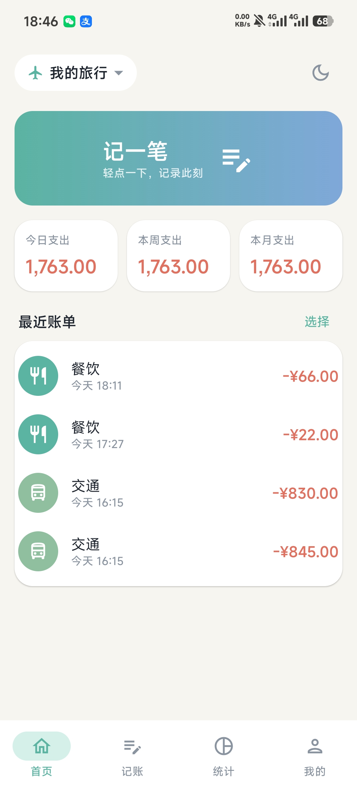
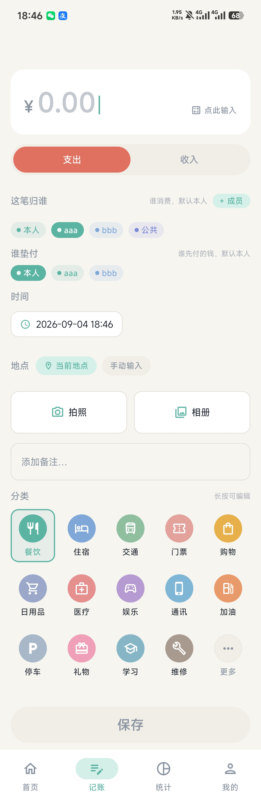
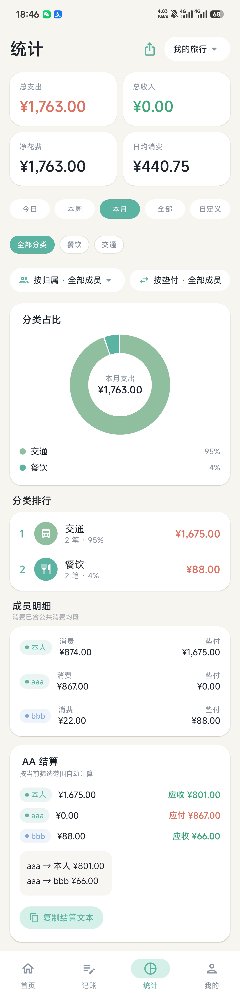
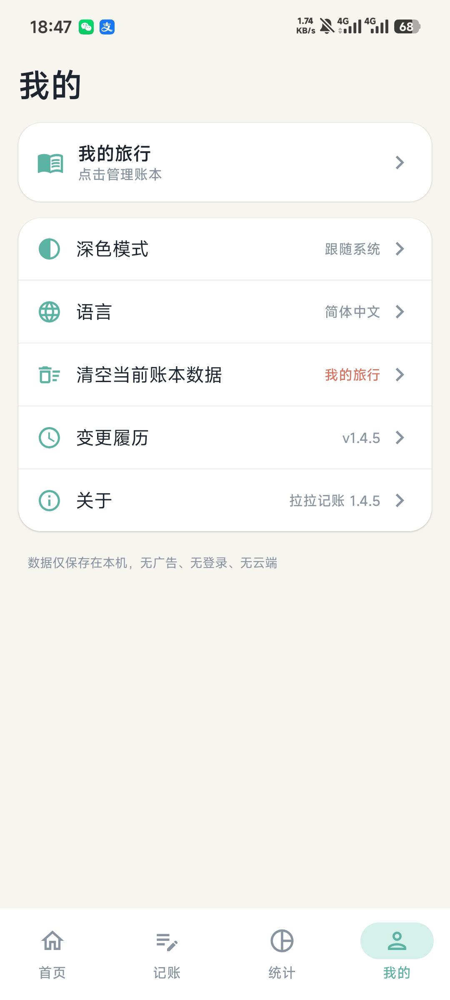

<div align="center">

# lalaledger · 拉拉记账

**A fully offline Android expense-tracking app — clean, fast, and beautiful**

No login · No ads · No cloud · No tracking — all data stays on your phone

`Android 10+` · `Kotlin 2.0` · `Jetpack Compose` · `Material 3` · `MIT License`

Current version **v1.4.6** · 中文文档：[README.md](README.md)

</div>

---

## Screenshots

<p>
  
  
  
  
</p>

---

## What is this app?

lalaledger is built for people who want to know where the money goes — without handing their ledger to any cloud:

- **Record in a second**: tap the amount card → pick a category → save. No sign-up, no loading screens, no splash ads;
- **Trips & group dinners**: switch to a trip book to track who spent and who paid, with a built-in "Shared" owner that splits group expenses evenly — plus an AA settlement that tells you exactly who owes whom;
- **Review & reflect**: pie chart + category ranking + member breakdown at a glance, exportable as a polished long image to your gallery.

Data lives 100% on your device — uninstalling removes everything, and the app never sends a single network request.

## ✨ Key Features

### 🔒 Fully offline, zero privacy concerns
- No network, no analytics, no uploads, no accounts; uninstalling wipes everything, and exported images only go to your gallery
- Minimal permissions: camera / location on demand only; gallery picks use the system Photo Picker and exports go through MediaStore — storage-permission-free on Android 10+

### ⚡ Fast recording, one bill a second
- Large amount card opens a floating numeric keypad (slides in as an overlay, never covers categories); auto-collapses after picking a category
- Tap or swipe the main UI to collapse the keypad; date & time are editable for backfilling; one-tap location + swipeable recent places
- Shoot or multi-select receipt photos with inline thumbnails and full-screen preview; every bill is fully editable anytime

### 🧳 Trip AA bookkeeping (signature feature)
- Mark any book as a "trip book": manage fellow members (10 color tags), pick **owner (who spent)** and **payer (who paid)** per bill, defaulting to self
- **"Shared" owner**: for group expenses like tickets or taxis, assign the bill to "Shared" — stats and settlement split it evenly across everyone
- **AA settlement**: auto-computes each member's net receivable / payable; a greedy algorithm yields the fewest transfers, with one-tap copy of the plan

### 📊 Clear stats, export & share
- Summary card (total expense / income / net / daily average) + category pie chart + ranking, filtered by today / week / month / all / custom range
- Multi-select category filter, dual-dimension member filters by owner / payer, independent stat-book switching
- **Three image exports**: stats long image (summary + ranking + member breakdown + AA settlement), multi-select bill summary image, single bill share card — all 1080px PNG, light/dark adaptive

### 🎨 Carefully polished details
- Light (cream + mint green) / dark themes; capsules, charts, and exported images all adapt to both
- Simplified Chinese / English one-tap switch in-app, effective instantly; UI and exported images fully bilingual
- 130+ curated category icons (full named picker, favorites replaceable); high-refresh-rate screens; keypad animates on the render layer, silky smooth
- Multi-select bills: select-all, live stats, batch delete, summary image; an in-app changelog documents every release

---

> Chinese documentation: [README.md](README.md)

- Tech stack: Kotlin 2.0 + Jetpack Compose (Material 3) + Room + DataStore + Navigation Compose
- Architecture: MVVM with clear layering (data / domain / ui / util)
- Minimum support: Android 10 (API 29), target API 35
- Languages: Simplified Chinese / English, switchable in-app (does not follow system)
- License: [MIT License](LICENSE)

---

## Feature Overview

| Module | Description |
| --- | --- |
| Multiple books | Create / delete / rename / switch books with optional icon & color; data fully isolated per book (FK CASCADE); **trip-book toggle** (checked on create or via menu; member features hidden in normal books) |
| Trip bookkeeping | Trip-book exclusive: **fellow-member management** (add/edit/delete, 10 color tags); when recording, pick **owner (who spent)** and **payer (who paid)** separately, defaulting to self, with quick add via the single **"+ Member" button at the top-right of the owner row**; **"Shared" owner = split across everyone** (built-in public member, auto-averaged in stats & settlement); detail / export images show **owner & payer capsule tags** (light/dark adaptive); deleting a member keeps historical bills; first-visit guide card |
| Backdated entry | Optional date & time per bill (date picker + 24-hour time picker), defaults to now — perfect for backfilling |
| Quick recording | Large amount card **opens a floating numeric keypad** (overlay style, never covers categories); auto-collapses after picking a category; **tapping or swiping the main UI both collapse the keypad** (collapse triggers on gesture end; a 120ms window guards the amount card against accidental dismissal); expense/income capsule toggle |
| Bill editing | "Edit" in the detail top bar enters edit mode; amount / type / category / member / payer / time / location / photos / note fully pre-filled; save keeps the original creation time |
| Categories | 14 preset expense + 5 income categories, **fully laid out** (no add button); long-press any category to rename / re-icon / re-color; replacing a pinned category via "More" swaps **both its icon and name** |
| Quick location | "Current location" one-tap GPS fill-in; swipeable chips of frequently used places; manual input supported |
| Receipt photos | Camera / multi-select from gallery (Photo Picker); images compressed into app-private storage; **inline thumbnails in bill list + tap for full-screen preview**; Pager zoom preview on detail page |
| Multi-select | Multi-select mode: round checkboxes, select-all / clear, live stats (count / total expense / total income / net); **first-visit hint**; bottom bar: generate summary image / batch delete (double-confirm) / cancel |
| Summary image export | One-tap 1080px-wide PNG long image saved to gallery: summary card + bill list (**owner/payer capsules** / amount / receipt thumbnail); theme-aware colors, up to 100 items |
| Single bill share image | Detail top-bar export: share card (amount / category / member / payer / time / location / note / receipt), light/dark adaptive |
| Statistics | Total expense / income / net / daily average; **switch stat book independently** (does not affect global current book); **category multi-select filter** (lists categories present in the book, instantly syncs charts and totals); period filter: today / week / month / all / custom; trip books support **dual-dimension member filtering by owner (incl. "Shared") / payer**; **member breakdown card** (each member's spend and paid totals, shared expenses already averaged) |
| Statistics image export | One-tap 1080px PNG long image from the stats top bar: summary card + category ranking (ratio bars) + member breakdown + AA settlement plan, light/dark adaptive, saved to gallery "Pictures/拉拉记账" |
| AA settlement | Trip-book AA settlement card: auto-computes each member's spend, paid, and **net receivable / payable** ("Shared" expenses split per head); greedy algorithm produces a **simplified transfer plan** (who pays whom, how much); **one-tap copy** of the settlement text with a success toast |
| Bill detail | Layered cards: amount / type / category / owner / payer / location / note / time / photos; top bar: share image / edit / delete double-confirm |
| Theme | Light (cream + mint green + misty blue) / Dark (deep blue-gray + soft teal) / follow system; capsules and components adapt to both themes |
| Language | Settings page **Simplified Chinese / English radio switch**, effective immediately (no restart); each language name is shown in its own language |
| About | About dialog (version + intro + **open-source license** + **disclaimer** entry); changelog (auto-follows UI language in both languages) |
| Performance | High-refresh-rate screens supported (auto-picks the device's highest refresh rate); keypad animation is render-layer translation (no measure/layout); Release builds use R8 + resource shrinking + zh/en resources only |

## Permission Policy (on-demand, minimal)

| Permission | Purpose | When |
| --- | --- | --- |
| `CAMERA` | Shoot receipts | Requested when tapping "Camera" |
| `ACCESS_FINE_LOCATION` / `ACCESS_COARSE_LOCATION` | "Current location" quick fill | Requested when tapping "Current location" |
| Storage | —— Not needed | Gallery uses system Photo Picker; image export uses MediaStore — permission-free on Android 10+ |

## Project Structure

```
app/src/main/java/com/lightledger/app/
├── LightLedgerApp.kt          # Application: AppContainer manual DI + language in-memory cache + first-launch seed data
├── MainActivity.kt            # Single Activity: attachBaseContext language injection + high refresh rate
├── data/
│   ├── db/
│   │   ├── AppDatabase.kt     # Room database (version 5)
│   │   ├── Converters.kt      # Image path list <-> JSON
│   │   ├── Migrations.kt      # Migration chain v1→v2→v3→v4→v5 (field/table templates)
│   │   ├── dao/               # Room DAOs (reactive Flow queries)
│   │   └── entity/            # TransactionEntity / CategoryEntity / AccountBookEntity
│   │                          #   / PlaceEntity / MemberEntity (payerMemberId FK, isPublic flag)
│   ├── prefs/SettingsDataStore.kt  # Theme / current book / language / guide-read flags
│   └── repository/            # Repositories: in-memory aggregation + DAO wrappers (SeedData, built-in shared member)
├── domain/
│   └── model/                 # TransactionType / StatPeriod / ThemeMode / IconLibrary (130+ bilingual icon names)
├── ui/
│   ├── app/AppViewModel.kt    # Global state: theme / book / language
│   ├── theme/                 # Material 3 theme + semantic colors + chart palette
│   ├── navigation/NavGraph.kt # Bottom nav + routes (home/record/stats/me/books/detail/edit/members)
│   ├── home/                  # Home: stat card + recent bills + multi-select + trip guide card
│   ├── record/                # Record: amount keypad / member dual pickers (incl. "Shared") / date-time / flat categories
│   ├── stats/                 # Stats: pie chart / ranking / member breakdown / AA settlement / image export
│   ├── detail/                # Bill detail
│   ├── books/  members/       # Book management / member management (built-in "Shared" member is locked)
│   ├── settings/              # Me: theme / language / wipe / changelog / about
│   └── components/            # BillRow (dual capsules) / MemberChip / dialogs, etc.
└── util/
    ├── MoneyFormat.kt  DateUtils.kt
    ├── SummaryImageExporter.kt # Canvas-drawn summary long image / single share image
    ├── StatsImageExporter.kt   # Canvas-drawn stats long image (summary / ranking / members / AA)
    ├── ImageStore.kt  LocationHelper.kt
    └── LocaleHelper.kt        # i18n: createConfigurationContext wrapper + Activity lookup
```

## Data Model

| Table | Key fields | Notes |
| --- | --- | --- |
| `account_books` | `name / icon / color / isTrip` | Books; `isTrip` gates member features |
| `transactions` | `bookId(FK CASCADE) / type / amount / categoryId(FK SET_NULL) / location / note / images(JSON) / memberId(FK SET_NULL) / payerMemberId(FK SET_NULL) / createdAt / updatedAt` | Bills; `memberId`=owner (who spent), `payerMemberId`=payer (who paid), null=self |
| `categories` | `name / icon / color / type / isDefault / sortOrder` | Categories shared globally (not per-book) |
| `members` | `bookId(FK CASCADE) / name / color / isPublic` | Trip members; `isPublic` = the "Shared" AA owner (at most one per book, shown localized, cannot be edited/deleted); deleting a normal member keeps bills (FK SET_NULL) |
| `places` | `name / usedAt` | Frequent places (sorted by last use) |

### Migration Chain (append new migrations to `Migrations.ALL`)

| Version | Changes |
| --- | --- |
| v1→v2 | `transactions.updatedAt`, `places` table |
| v2→v3 | `members` table, `account_books.isTrip`, `transactions.memberId` FK |
| v3→v4 | `transactions.payerMemberId` FK (SET_NULL) + index |
| v4→v5 | `members.isPublic` flag (the "Shared" AA owner) |

> Note: Room validates column definitions strictly against the schema JSON. `ALTER TABLE ADD COLUMN` with `REFERENCES` must match the entity annotation exactly (including `ON DELETE` behavior), otherwise the app crashes on startup.

## Key Design Decisions & Technical Points

- **Amounts stored as "cents" (Long)**: avoids floating-point errors; `MoneyFormat` handles all display conversion.
- **Current book is globally reactive**: `AppViewModel.currentBookId` is the single source of truth (persisted in DataStore); home/record/stats all follow via `flatMapLatest`; stats page additionally supports an independent stat-book switch (does not change the global one).
- **i18n with zero AppCompat dependency**: `LocaleHelper.wrap()` wraps Context via `createConfigurationContext`; `MainActivity.attachBaseContext` reads the Application in-memory cache (kept in sync by a DataStore collector); switching language = write DataStore → update memory → `activity.recreate()`, zero blocking IO.
- **AA settlement algorithm**: each member's net = paid − spent; net>0 receivable, <0 payable; greedy pairing (largest creditor ↔ largest debtor) yields the fewest simplified transfers.
- **Keypad collapse gesture**: custom `awaitEachGesture` logic — collapse fires on gesture end when it was a "tap on the main UI" (movement beyond `touchSlop×4` or consumed scroll events count as a swipe and do not collapse); a 120ms window guards the amount card right after collapse.
- **"Shared" expense averaging**: entering a trip book's record page calls `ensurePublicMember` to guarantee the built-in "Shared" member exists (`members.isPublic` flag; stored as "公共", displayed per locale); the stats AA section splits shared spending per participant — `share = publicTotal / n`, with the remainder covered by the first r members at 1 cent each, so totals match to the cent; only the owner can be "Shared", the payer must be a real person.
- **Date-time picker pitfall**: M3 `DatePicker`'s `selectedDateMillis` is **UTC midnight of that day**; convert via `atZone(UTC).toLocalDate()` then combine with TimePicker hour/minute in the local zone — otherwise an 8-hour offset appears.
- **High refresh rate**: `requestHighestRefreshRate()` picks the highest mode from `display.supportedModes` and sets `preferredDisplayModeId` (API 30+ via `Activity.display`).
- **Summary long-image memory control**: hand-drawn 1080px PNG via `android.graphics.Canvas` (RGB_565 + 100-item cap), saved through MediaStore without storage permission.
- **Image lifecycle**: camera/gallery images are uniformly compressed (longest edge 1600px, JPEG 85) and copied into `files/Receipts/`; files are cleaned up on bill delete, batch delete, and edit-removal.

## Development Constraints (read before modifying code)

1. **All user-visible strings must go through string resources**: Chinese in `res/values/strings.xml`, English in `res/values-en/strings.xml`, always kept in sync; UI uses `stringResource(R.string.xxx)`, non-Compose contexts use `context.getString(...)`; ViewModels must not return text strings — return resource ids (Int) and let the UI resolve them.
2. **Any DB schema change must**: bump `AppDatabase.version` → add `MIGRATION_n_m` in `Migrations.kt` and append it to the `ALL` array → after building, verify column definitions against the generated JSON in `app/schemas`.
3. **No category-add entry** (preset categories cover all scenarios to avoid fragmentation); long-press to rename / re-icon / re-color.
4. **Member rules**: deleting a member must keep bills (FK SET_NULL, never CASCADE); null owner/payer means "self", shown via the `record_self` string.
5. **No member UI in non-trip books**: all member features require `isTrip == true`.
6. **Keypad/animation performance red line**: the keypad overlay must only use `graphicsLayer` render-layer translation; never animations that trigger measure/layout (e.g., `animateDpAsState` offsets).
7. **Every new screen must be fully bilingual**; strings with parameters use `%1$s` / `%1$d` placeholders; `&` in XML must be written as `&amp;`.
8. **Release builds must keep** R8 minify + shrinkResources + signing; `keystore/lalaledger.jks` is a demo keystore (passwords are inside `build.gradle.kts`), replace it with your own for production.

## Building from Source

```bash
# Requirements: JDK 17 + Android SDK (compileSdk 35 / build-tools 35.0.0) + Gradle 9.3
# Debug build
gradle assembleDebug
# Release build (R8 + signing, output app/build/outputs/apk/release/lalaledger-v1.4.6.apk)
gradle assembleRelease
```

- New screen: create Screen + ViewModel under `ui/<feature>/` → add route in `NavGraph.kt` → strings into both strings.xml files.
- New DB field: add field to entity (with default) → migration chain → pass through repository/ViewModel.
- New stat dimension: filter/aggregate `byCategory` (after time+category filtering) inside `StatsViewModel.compute()`; summary card / pie chart / ranking sync automatically.
- New string: write Chinese in `values/strings.xml` first, then mirror in `values-en/strings.xml`; a missing key with the same name crashes English environments.

## License & Disclaimer

This project is open-sourced under the [MIT License](LICENSE). In-app: "Me → About → License / Disclaimer" shows the full text (bilingual). Summary:

- Free to use, copy, modify, merge, publish, distribute, sublicense, and sell.
- The software is provided "as is", without warranty of any kind; AA settlement and transfer plans are for reference only — verify before use.
